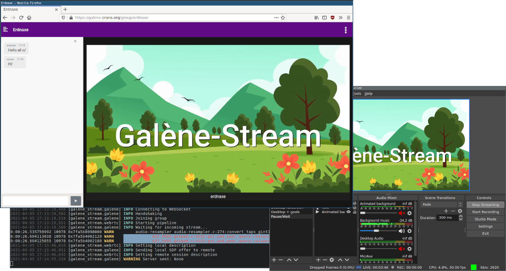

# Galène streaming gateway

Gateway to send streams such as RTMP or SRT to
[Galène videoconference server](https://galene.org/).
It is based on Gstreamer and implements the Galène protocol.

Tested on Debian Bullseye, Ubuntu 20.04, Ubuntu 20.10, ArchLinux and NixOS 20.09.

**This project is still not production ready, and you might experience
jittering and crashes.**



## User guide

Real-time video conversion requires resources. If many users are going to use
this gateway simultaneously, you should scale your machine resources
accordingly.

### Installation on Debian/Ubuntu

```bash
sudo apt install python3-pip python3-gi python3-gi-cairo python3-websockets gir1.2-gst-plugins-bad-1.0 gstreamer1.0-plugins-good gstreamer1.0-plugins-bad gstreamer1.0-plugins-ugly gstreamer1.0-libav gstreamer1.0-nice
pip3 install --user galene-stream
```

### Installation on ArchLinux

```bash
sudo pacman -S python-setuptools python-pip python-websockets python-gobject gobject-introspection gst-python gst-plugins-base gst-plugins-bad gst-plugins-ugly gst-libav
pip install --user galene-stream
```

### Installation from source code using Python Virtualenv

Start by cloning the source code,

```bash
git clone https://github.com/erdnaxe/galene-stream
cd galene-stream
```

Then create a Python VirtualEnv and install galene-stream inside,

```bash
python -m venv venv --system-site-packages
source venv/bin/activate
pip install -e .
```

### Configuration for UDP streaming

Launch the gateway using:

```
galene-stream --input "udp://localhost:8888" --output "wss://galene.example.com/ws" --group test --username bot
```

Then you can stream to `udp://localhost:8888` with no stream key.

### Configuration for RTMP streaming

```
+--------------------+      +----------+      +-------------+        +------+
|Streaming software  | RTMP |NGINX RTMP| RTMP |Galène Stream| WebRTC |Galène|
|(such as OBS-Studio)+------>  Server  <------+   Gateway   +-------->      |
+--------------------+      +----------+      +-------------+        +------+
```

You need a NGINX RTMP server, you may remix the provided
[nginx.conf](./docs/nginx.conf). You can launch NGINX as user using:

```
nginx -c nginx.conf -p $PWD
```

You may launch the gateway after the NGINX server using:

```
galene-stream --input "rtmp://localhost:1935/live/test" --output "wss://galene.example.com/ws" --group test --username bot
```

Then you can stream to `rtmp://127.0.0.1:1935/live` with stream key `test`.

### Configuration for SRT streaming

SRT support is still experimental in some Linux distributions.
It has been reported to work on ArchLinux (on 2021/03/30).

When using OBS, you need to have FFMpeg compiled with SRT support.
To check if SRT is available, run `ffmpeg -protocols | grep srt`.
On Windows and MacOS, OBS comes with his own FFMpeg that will work.

Launch the gateway using:

```
galene-stream --input "srt://localhost:9710?mode=listener" --output "wss://galene.example.com/ws" --group test --username bot
```

Then you can stream to `srt://localhost:9710` with no stream key.

More information on [OBS Wiki, Streaming With SRT Protocol](https://obsproject.com/wiki/Streaming-With-SRT-Protocol).

### Configuration for file streaming

For debugging purposes you can directly stream a file,

```
galene-stream --input "file://source.webm" --output "wss://galene.example.com/ws" --group test --username bot
```

## Contributing

See [contributing guidelines](./CONTRIBUTING.md).

### Collecting statistics about GStreamer WebRTC element

During a stream, you can send `!webrtc` in the chat to get some statistics
about the connectivity between the gateway and Galène.

### Debugging GStreamer pipeline

#### Logging pipeline statistics

You may use these environment variables,

```
GST_DEBUG="GST_TRACER:7" GST_TRACERS="latency;stats;rusage" GST_DEBUG_FILE=trace.log
```

Then you may inspect logs using `gst-stats-1.0 trace.log`.

#### Plotting pipeline graph

It is possible to plot pipeline status just before exiting the script by setting
`GST_DEBUG_DUMP_DOT_DIR` environnement variable to a directory.

For example, `export GST_DEBUG_DUMP_DOT_DIR=.`.

Then you can use GraphViz to generate an image from the dot file:
`dot -Tpng pipeline.dot > pipeline.png`.

## Authors

This gateway is currently developed by members from
[Crans](https://www.crans.org/)
and [Aurore](https://auro.re/) network organizations to build a self-hosted
free and open-source streaming server.

Main contributors:

-   Alexandre Iooss

## License

We believe in open source software.
This project is licensed under [MIT](./LICENSE.txt).
